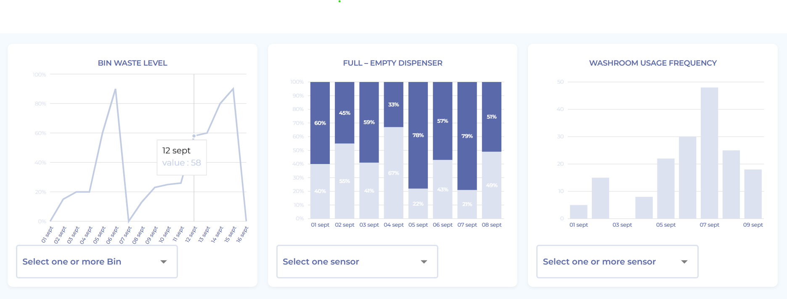
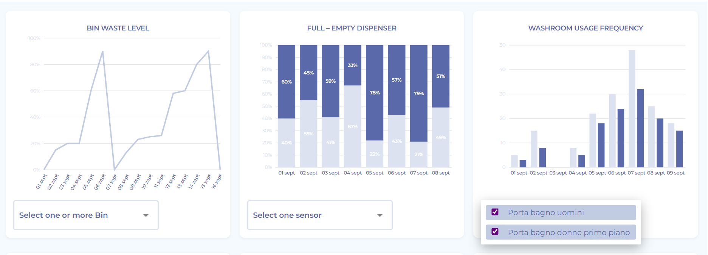
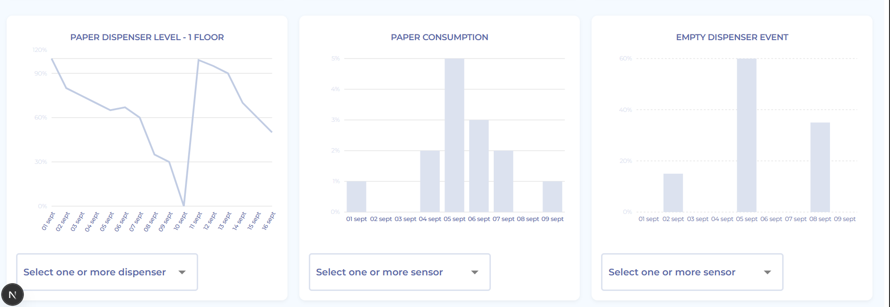
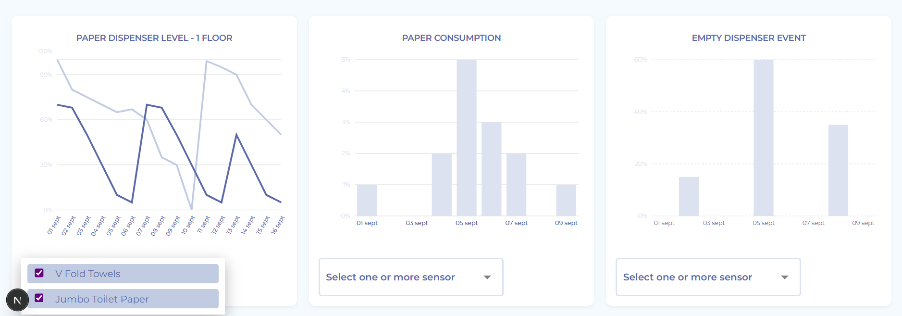

# Dashboard Assignment - Naung

This is my completed frontend dashboard assignment based on the design from https://www.youtissue.com/.

## 📸 Screenshot Preview

## 🚀 Technologies Used
- Next.js
- Recharts
- Dummy data
- CSS-in-JS styling

## 📂 Features
- Reusable chart components
- Filter dropdowns