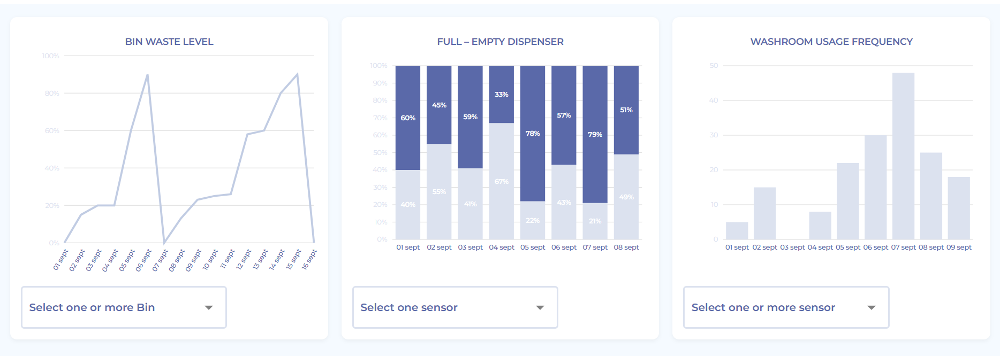
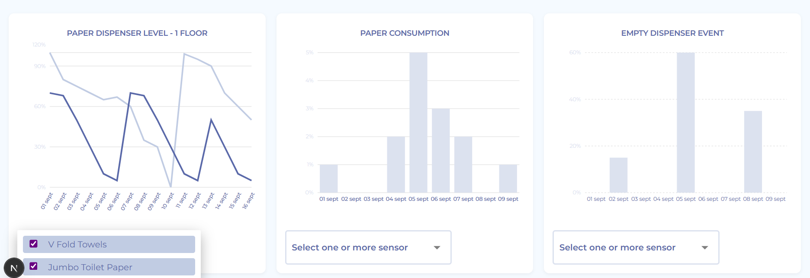

# Dashboard Assignment - Naung

This is my completed frontend dashboard assignment based on the design from https://www.youtissue.com/.

## 📸 Screenshot Preview






## 🚀 Getting Started

### 1. Clone the Repository

```bash
git clone https://github.com/Naung2024/naung-dashboard-test.git
cd naung-dashboard-test

npm install

npm run dev

http://localhost:3000


## 🚀 Technologies Used
- Next.js
- Recharts
- Dummy data
- CSS-in-JS styling

## 📂 Features
- Reusable chart components
- Filter dropdowns
